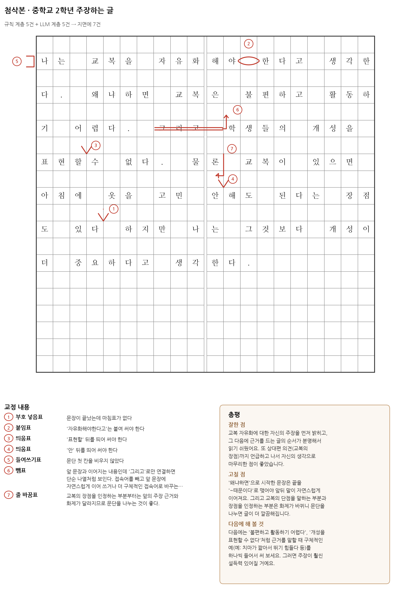

# 원고지 첨삭기 (wongoji)

한국어 학생 글을 받아 **원고지 격자 위에 교정부호가 얹힌 첨삭본**을 만든다.
교사가 항목별로 승인·수정·기각한 뒤 인쇄 가능한 PNG/PDF로 돌려주는 것까지가 한 주기다.

기존 자동 첨삭은 빠르지만 화면에 갇혀 있고, 사람 첨삭은 종이로 나오지만 며칠이 걸린다.
이 도구는 **원고지 격자를 1급 데이터 구조로 다룬다.** 칸 좌표가 있으면 부호를 정확한 자리에 그릴 수 있고,
그것이 곧 학생이 손에 들고 고쳐 쓸 수 있는 종이가 된다.



## 무엇이 다른가

국내 서비스 조사 결과(`docs/리서치_한국어첨삭_시장과자원.md`), 맞춤법 검사기들은 이미 교정부호로 오류를 표시한다.
그러나 표시 대상이 웹 텍스트이고, **원고지 지면 형식 — 문단 첫 칸, 제목 위치, 줄 끝 문장부호 매달기 —
을 교정 대상으로 보는 서비스는 없다.** 초·중등 국어 평가에서 실제 감점 항목인데도 그렇다.

## 구조

```
원문 ─┬─▶ 규칙 계층 (결정적)                      ┐
      │    · 띄어쓰기 후보       kiwipiepy space() │
      │    · 종결부호 누락       split_into_sents()│
      │    · 문단 첫 칸·지면 형식                  ├─▶ 정규화 ─▶ 검증 게이트 ─▶ 초점 필터
      └─▶ LLM 계층 (생성적)                        │                            │
           · 겹말·상투어·문체·호응                 │                            ▼
           · 문단 나누기 / 총평 3단                ┘                  원고지 렌더러 (PNG·PDF·SVG)
                                                                                │
                                                        교사 검토(승인·수정·기각) ─▶ 학생에게
```

계층을 나눈 이유는 근거가 있다. KAGAS 논문(ACL 2023)은 한국어 모어 화자 오류 말뭉치에서
**수집된 오류 유형의 대부분이 띄어쓰기**였다고 보고하고, KoGEC 논문은 대형 LLM이 문장부호 오류에
상대적으로 소홀하다고 관찰한다. 가장 빈번한 오류가 LLM이 가장 약한 영역이므로, 그 층은 규칙으로 처리한다.

예시 두 편 실측에서 **지면에 그려진 11건 중 8건이 규칙 계층** 출처였다.

## 검증 게이트

LLM은 부호를 잘못 고르고, 없는 오류를 만들고, 한 문장을 통째로 바꾸라고 한다. 게이트가 그것을 막는다.

**정규화** — 띄어쓰기만 다른 교체는 붙임표로, 문장부호 삽입은 부호 넣음표로 바꾼다.
이미 그 부호가 있는 자리에 또 넣으라는 항목은 폐기한다.

**반려 규칙**

| 규칙 | 이유 |
|---|---|
| target을 본문에서 찾지 못함 | 부호를 그릴 자리가 없다 |
| span 부호 범위 12자 초과 | 지면에서 읽을 수 없는 부호가 된다 |
| 고침표의 원문·대체문 8자 초과 | 문장 통째 교체는 부호가 아니라 총평에 쓸 내용이다 |
| 삽입 문자 4자 초과 | 칸에 들어가지 않는다 |
| 사유가 비어 있음 | 설명할 수 없는 지적은 첨삭이 아니다 |
| 규칙 계층 항목과 자리 겹침 | 같은 자리에 부호 둘을 그릴 수 없다. 결정적 계층 우선 |
| 되살림표·줄 이음표·끌어 올림/내림표·내어쓰기표 | 교사가 지면을 편집할 때 쓰는 부호다 |

예시 두 편에서 LLM이 낸 11건 중 8건이 반려됐고, 그린 11건의 칸 좌표는 모두 실제 오류 위치와 일치했다.

## 실행

```bash
pip install -r requirements.txt
python -m uvicorn server:app --port 8000     # http://127.0.0.1:8000
```

첫 화면에서 학생 글을 붙여 넣고 첨삭을 실행한다. 검토 화면에서 항목을 승인·수정·기각한 뒤 PNG 또는 학생용 PDF를 받는다.

### Vercel

`server.py`의 FastAPI `app`을 그대로 배포한다. 프로젝트 환경변수에 키를 넣는다.

- `CHUMSAK_PROVIDER` (`xai` / `gemini` / `anthropic` / `openai`)
- `CHUMSAK_MODEL` (예: `grok-4.6`, `claude-sonnet-5`)
- `XAI_API_KEY` / `GEMINI_API_KEY` / `ANTHROPIC_API_KEY` / `OPENAI_API_KEY`

서버리스라 세션·설정 파일은 `/tmp`에만 남는다. 키는 대시보드 환경변수가 진실이다.

LLM 계층 없이도 돌아간다(규칙 계층만, 총평은 비어 있음). `CHUMSAK_NO_LLM=1`로 강제할 수 있다.
웹 화면의 **API 키**에서 제공자(xAI / Gemini / Anthropic / OpenAI)와 키를 저장한다.
키가 없으면 이 컴퓨터의 Grok CLI 로그인(`~/.grok/auth.json`)을 xAI 호스트로 쓴다.
직접 주입하려면 `server.HOST`에 아래 인터페이스를 만족하는 객체를 넣는다.

```python
host.llm({"messages": [...], "system": str, "tools": [schema],
          "tool_choice": {...}, "max_tokens": int, "model": str}) -> {"tool_use": {...}}
host.reasoning_model() -> str
```

Anthropic API용 어댑터 예시는 `llm_anthropic.py`에 있다(이 저장소에서 실행 검증되지 않은 참고 코드).

### 서버 없이 보기

`examples/첨삭검토_데모.html`을 브라우저로 열면 실제 첨삭 결과가 담긴 교사 검토 화면이 나온다.
승인·기각·필터·총평 편집이 동작한다(내보내기는 서버 필요).

### 라이브러리로 쓰기

```python
import chumsak_app as CA
from kiwipiepy import Kiwi

res = CA.chumsak(text, host, Kiwi(), out="첨삭본.png", grade="초등 6학년",
                 focus=["space", "punct"],   # 초점 첨삭
                 indirect=False)             # True면 정답을 □로 가린다
print(res["counts"], res["dropped"])
```

원고지 렌더러만 쓰려면 JSON 명세를 넘긴다. `examples/spec_예시.json`이 그대로 도는 예시다.

```bash
python wongoji_render.py examples/spec_예시.json   # PNG/PDF (spec["out"] 경로로 저장)
python wongoji_svg.py    examples/spec_예시.json   # SVG (부호마다 data-n, 브라우저 상호작용용)
```

명세의 핵심은 `corrections` 항목의 기준점 두 갈래다.
`space`·`insert`·`punct`·`newline`·`joinline`은 **target 바로 뒤 경계**에 부호를 놓고,
나머지 아홉(`join`·`delete`·`replace`·`swap`·`indent`·`outdent`·`up`·`down`·`stet`)은
**target 범위 전체**를 덮는다. `insert`·`punct`·`replace`는 `text`가 필수다.
`corrections`와 `review`를 비우면 서식 예시·연습지가 된다.

## 파일

| 경로 | 내용 |
|---|---|
| `wongoji_render.py` | 원고지 배치 + 교정부호 작도. 칸 좌표 계산의 단일 출처 |
| `wongoji_svg.py` | 같은 기하 계산으로 SVG 출력. 부호마다 `<g class="mk" data-n="N">` |
| `chumsak_app.py` | 규칙 계층·LLM 계층·정규화·게이트·파이프라인 |
| `server.py` | FastAPI. `/api/chumsak`, `/api/export`, `/api/session`, `/api/health` |
| `web/` | 교사 검토 화면 (의존성 없는 바닐라 JS) |
| `docs/` | 기획서, 시장·오픈소스 리서치, 원고지 표기 규칙과 첨삭 방법론 |
| `examples/` | 첨삭본 PNG·PDF, 실행 결과 원자료, 정적 데모 HTML |

## 설계에서 지킨 것

- **점수를 매기지 않는다.** 자동 채점을 대학 수업에 투입한 선행 연구들이 공통적으로 교수자 최종 평가로
  보완해야 한다고 결론했다. 점수를 넣으면 교사 검토가 형식이 된다.
- **기각한 항목을 지우지 않는다.** 되살림표로 지면에 남겨, 학생이 무엇이 되살려졌는지 본다.
  이 기각 이력이 프롬프트·게이트 개선의 유일한 학습 신호다.
- **초점 첨삭이 기본.** 이번 회차에 볼 부호를 지정하면 나머지는 집계만 하고 그리지 않는다.
- **정답을 써 주지 않는 모드가 있다.** 간접 첨삭에서는 넣음표·고침표의 정답을 □로 가린다.

## 알려진 한계

- 같은 원고를 다시 돌리면 LLM 계층의 항목 구성이 달라진다. 게이트가 매번 다시 판정하므로 품질은
  유지되지만 **항목 목록은 재현되지 않는다.** 운영에서는 온도를 낮추고 회차별 결과를 저장해 비교한다.
- `kiwipiepy`의 띄어쓰기 교정은 **붙여 쓴 곳을 띄우지만, 잘못 띄운 곳을 붙이지는 못한다.**
  붙임표 후보는 LLM 계층이 담당한다.
- 원고지 사진 입력(OCR)은 아직 없다. 기획서 2단계.
- 부호의 세부 모양은 법정 표준이 아니라 출판·교육 현장의 관례여서 교재마다 다르다.
  한 원고 안에서 일관되게 쓰는 편이 세부 형태보다 중요하다.

## 쓰지 않는 것

네이버·다음 검사기 래퍼(py-hanspell 등)와 부산대 검사기 크롤링은 쓰지 않는다.
전자는 결과의 저작권·책임이 해당 회사에 있고, 후자는 비상업적 개인 이용으로 한정된다.
규칙 계층은 오픈 라이선스 자원과 자체 코드로만 구성한다.
