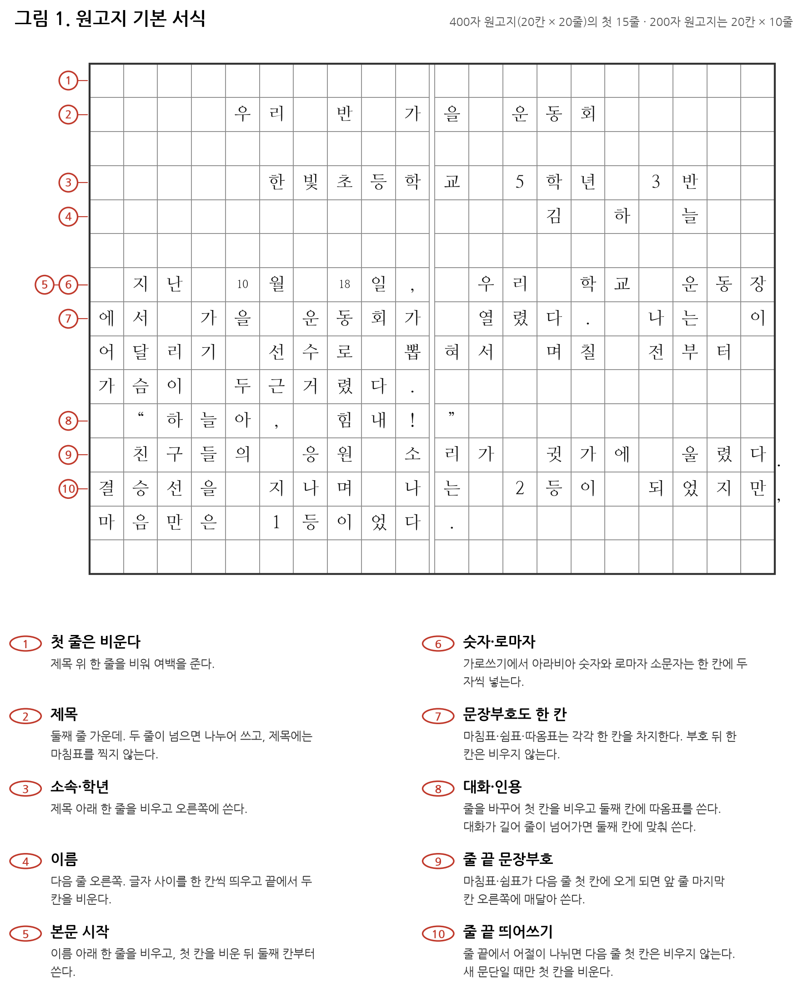
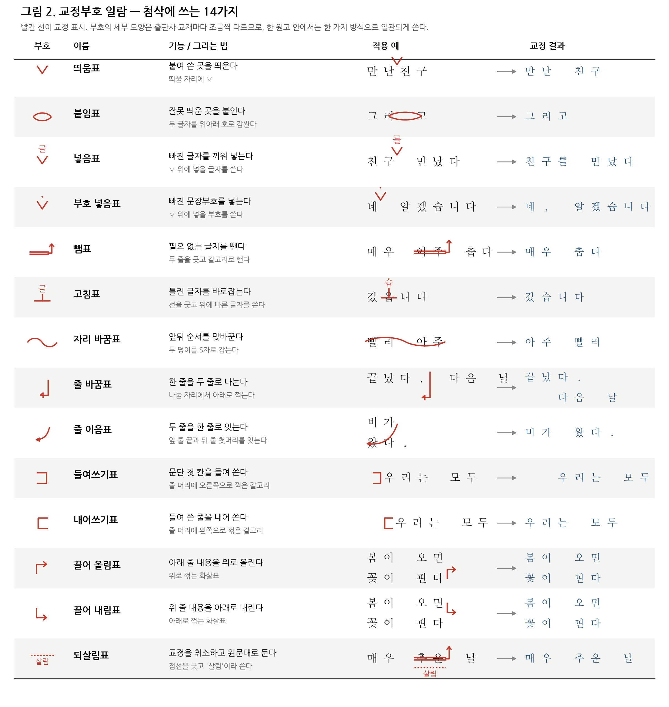
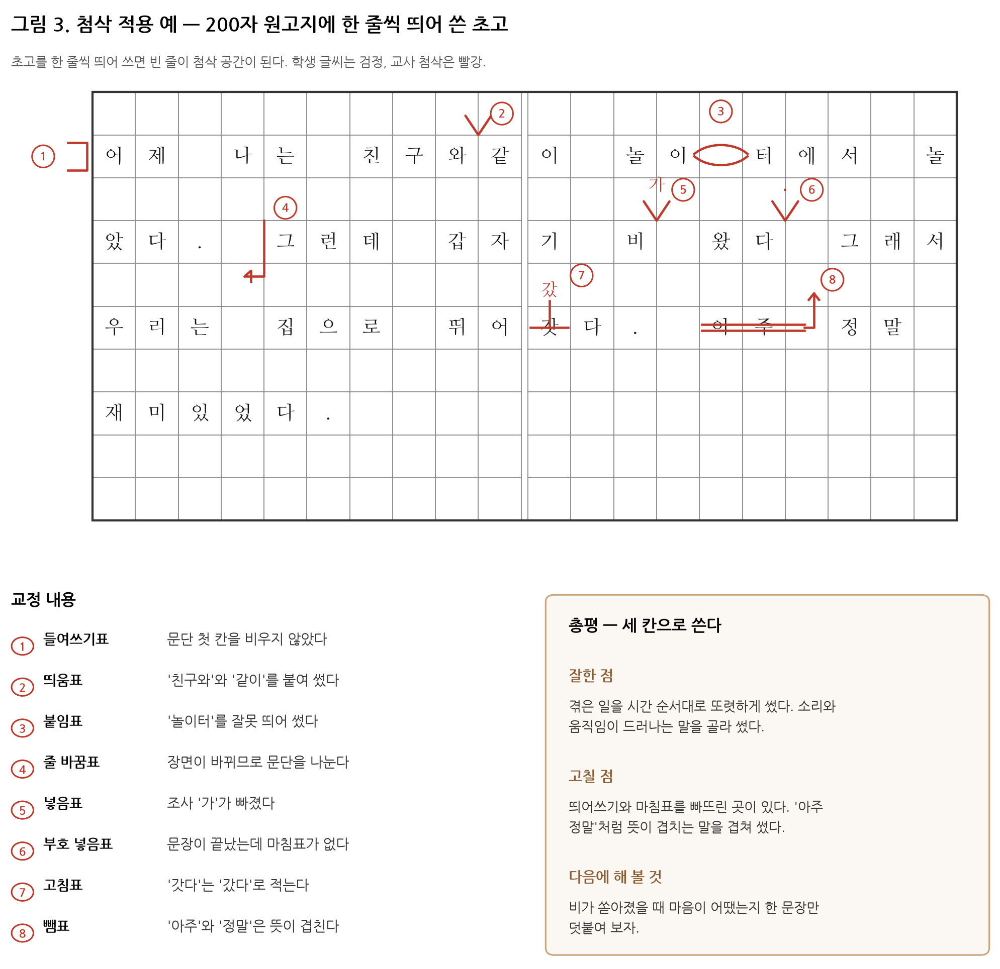

# 한국어 원고지 쓰는 법과 첨삭하는 법

작문 지도용 정리본. 1부는 원고지 표기 규칙, 2부는 교정부호, 3부는 첨삭 절차와 판단 기준을 다룬다.
표기 규정의 근거는 한글 맞춤법(문화체육관광부 고시)과 그 부록인 문장부호 규정이며,
원고지 사용법과 교정부호의 세부 모양은 법정 표준이 아니라 출판·교육 현장의 관례이므로
교재마다 조금씩 다르다. 한 학급·한 원고 안에서 한 가지 방식으로 일관되게 쓰는 것이 규칙의 세부보다 중요하다.

---

## 1부 · 원고지 쓰는 법

### 1.1 왜 아직 원고지인가

원고지의 교육적 기능은 세 가지다.

1. **분량 감각** — 한 칸이 한 글자이므로 200자·400자·1,000자가 눈에 보이는 부피로 바뀐다.
2. **띄어쓰기의 시각화** — 빈 칸이 곧 띄어쓰기다. 화면에서는 보이지 않던 오류가 칸으로 드러난다.
3. **문장부호의 자리 훈련** — 부호도 한 칸을 차지하므로 부호를 문장의 부속물이 아니라 성분으로 다루게 된다.

### 1.2 규격

| 형식 | 칸 구성 | 총 글자 수 | 쓰임 |
|---|---|---|---|
| 200자 원고지 | 20칸 × 10줄 | 200자 | 학교 작문, 일반 원고의 기본 |
| 400자 원고지 | 20칸 × 20줄 | 400자 | 장편 원고, 매수 계산용 |

- 현재는 **가로쓰기**가 표준이다. 세로쓰기 원고지는 오른쪽 위에서 시작해 아래로 쓰고 왼쪽으로 넘어간다.
- 원고 매수는 200자 원고지 기준으로 센다("200자 원고지 15매").
- 필기구는 지워지지 않는 검정·파랑 펜을 쓰고, 학생 글씨와 구별되도록 **첨삭은 빨강**으로 한다.

### 1.3 첫머리 — 제목·소속·이름

1. **첫 줄은 비운다.** 제목 위 한 줄을 여백으로 둔다.
2. **제목은 둘째 줄 가운데.** 좌우 여백을 같게 맞춘다. 제목이 짧으면 글자 사이를 한 칸씩 띄워 폭을 맞추고, 한 줄에 넘치면 두 줄로 나누어 쓴다. **제목에는 마침표를 찍지 않는다.** 부제가 있으면 제목 아래 줄에 줄표(—)로 감싸 쓴다.
3. **소속·학년은 제목 아래 한 줄을 비우고 오른쪽에.**
4. **이름은 그 다음 줄 오른쪽에.** 글자 사이를 한 칸씩 띄우고, 오른쪽 끝에서 두 칸쯤을 비운다.
5. **본문은 이름 아래 한 줄을 비우고 시작한다.**

### 1.4 본문 표기 규칙

**한 칸에 한 자.** 한글·한자·문장부호는 모두 한 칸을 차지한다. 예외는 두 가지다.

- 아라비아 숫자와 로마자 **소문자**는 가로쓰기에서 한 칸에 두 자씩 넣는다(`10`·`18`·`ap`).
- 로마자 **대문자**는 한 칸에 한 자씩 쓴다.

**문단.** 새 문단은 첫 칸을 비우고 둘째 칸부터 쓴다. 문단이 바뀌지 않는데 줄이 넘어간 경우에는 다음 줄 첫 칸을 비우지 않는다. 즉 **첫 칸이 비어 있다는 것은 곧 새 문단이라는 표시**다.

**띄어쓰기가 줄 끝에 걸릴 때.** 띄어쓰기 자리가 줄의 끝과 겹치면 그 빈 칸은 없는 것으로 보고, 다음 줄 첫 칸부터 이어 쓴다. 빈 칸을 살리려면 앞 줄 마지막 칸을 비워 둔다.

**문장부호.**

- 마침표·쉼표·물음표·느낌표·따옴표는 각각 한 칸을 차지한다.
- 마침표·쉼표 **뒤의 한 칸은 비우지 않는다.** 다만 물음표·느낌표 뒤에 다른 문장이 이어질 때는 한 칸을 비운다.
- 말줄임표(……)는 여섯 점이 원칙이며 세 점씩 두 칸에 나누어 쓴다.
- 줄임표나 줄표가 줄 끝에 걸리면 그 줄에서 끊고 다음 줄에서 이어 쓴다.
- **마침표·쉼표·닫는 따옴표는 줄의 첫 칸에 오지 않게 한다.** 앞 줄 마지막 칸에 글자와 함께 밀어 넣거나, 칸 밖 오른쪽에 매달아 쓴다(그림 1의 ⑨).

**대화와 인용.**

- 대화는 줄을 바꾸어, 첫 칸을 비우고 **둘째 칸에 여는 따옴표**를 쓴다.
- 대화가 길어 줄이 넘어가면 첫 칸을 비운 채 둘째 칸에 맞추어 이어 쓴다(대화 전체가 한 문단처럼 들여쓰기된다).
- 대화가 끝난 뒤 지문으로 돌아가면 다시 줄을 바꾼다.
- 짧은 인용은 문장 안에 큰따옴표로 넣고, 긴 인용은 줄을 바꾸어 앞뒤로 한 줄을 비우고 두세 칸 들여 쓴다.

**시·운문.** 제목 아래 두세 줄을 비우고, 행의 첫 칸을 두세 칸 들여 통일한다. 연이 바뀌면 한 줄을 비운다. 행이 길어 줄이 넘어가면 다음 줄에서 더 들여 써서 새 행이 아님을 표시한다.

**그 밖에.**

- 괄호·따옴표 안의 부호도 각각 한 칸이다.
- 각주 번호는 해당 글자 오른쪽 위에 작게 쓰고, 각주 내용은 원고 끝이나 별지에 모아 쓴다.
- 쪽 번호와 매수는 원고지 하단 또는 상단 여백에 적는다.

### 1.5 원고지 형식 자기 점검표

- [ ] 첫 줄을 비웠는가
- [ ] 제목이 가운데에 있고 마침표가 없는가
- [ ] 소속·이름이 오른쪽에 있고 이름 뒤에 여백이 있는가
- [ ] 본문 첫 칸을 비웠는가 / 문단이 바뀔 때만 비웠는가
- [ ] 문장부호가 각각 한 칸을 차지하는가
- [ ] 마침표·쉼표가 줄 첫 칸에 오지 않았는가
- [ ] 대화가 줄을 바꾸어 둘째 칸에서 시작하는가
- [ ] 숫자를 한 칸에 두 자씩 넣었는가

---

## 2부 · 교정부호

### 2.1 열넷의 부호

| 부호 | 기능 | 그리는 법 |
|---|---|---|
| 띄움표 | 붙여 쓴 곳을 띄운다 | 띄울 자리에 ∨ |
| 붙임표 | 잘못 띄운 곳을 붙인다 | 두 글자를 위아래 호로 감싼다 |
| 넣음표 | 빠진 글자를 끼워 넣는다 | ∨ 위에 넣을 글자를 쓴다 |
| 부호 넣음표 | 빠진 문장부호를 넣는다 | ∨ 위에 넣을 부호를 쓴다 |
| 뺌표 | 필요 없는 글자를 뺀다 | 두 줄을 긋고 갈고리로 뺀다 |
| 고침표 | 틀린 글자를 바로잡는다 | 선을 긋고 위에 바른 글자를 쓴다 |
| 자리 바꿈표 | 앞뒤 순서를 맞바꾼다 | 두 덩이를 S자로 감는다 |
| 줄 바꿈표 | 한 줄을 두 줄로 나눈다 | 나눌 자리에서 아래로 꺾는다 |
| 줄 이음표 | 두 줄을 한 줄로 잇는다 | 앞 줄 끝과 뒤 줄 첫머리를 잇는다 |
| 들여쓰기표 | 문단 첫 칸을 들여 쓴다 | 줄 머리에 오른쪽으로 꺾은 갈고리 |
| 내어쓰기표 | 들여 쓴 줄을 내어 쓴다 | 줄 머리에 왼쪽으로 꺾은 갈고리 |
| 끌어 올림표 | 아래 줄 내용을 위로 올린다 | 위로 꺾는 화살표 |
| 끌어 내림표 | 위 줄 내용을 아래로 내린다 | 아래로 꺾는 화살표 |
| 되살림표 | 교정을 취소하고 원문대로 둔다 | 점선을 긋고 '살림'이라 쓴다 |

부호별 적용 예와 교정 결과는 `교정부호_일람.csv`에 표로 정리해 두었다.

### 2.2 부호를 쓸 때의 원칙

1. **원문을 지우지 않는다.** 지우개나 덧칠로 원문을 없애면 학생이 무엇을 어떻게 고쳤는지 되짚을 수 없다. 선을 긋고 그 위에 고친 글자를 쓴다.
2. **부호는 겹치지 않게 그린다.** 한 자리에 두 부호가 겹치면 무엇을 지시하는지 알 수 없다. 고칠 것이 많으면 그 줄 전체를 뺌표로 처리하고 여백에 다시 써 준다.
3. **여백과 빈 줄을 쓴다.** 초고를 **한 줄씩 띄어 쓰게 하면** 빈 줄이 그대로 첨삭 공간이 된다. 원고지 첨삭에서 가장 실용적인 준비다.
4. **색을 나눈다.** 학생 글씨는 검정, 교사 첨삭은 빨강, 학생이 스스로 고친 것은 파랑처럼 층을 나누면 수정 이력이 남는다.
5. **되살림표를 알려 준다.** 교사가 잘못 고쳤을 때 학생이 이의를 표시할 수 있는 통로가 된다.

---

## 3부 · 첨삭하는 법

### 3.1 첨삭의 두 층위

'첨삭(添削)'은 말 그대로 **더하고 덜어내는 일**이다. 실제로는 성격이 다른 두 작업이 섞여 있으므로 구분해서 다루어야 한다.

| 층위 | 대상 | 도구 | 판정 |
|---|---|---|---|
| 표기 교정 | 맞춤법·띄어쓰기·문장부호·원고지 형식 | 교정부호 | 맞고 틀림이 정해진다 |
| 내용 첨삭 | 주제·구성·문단·문장·어휘 | 여백 주석과 총평 | 더 나은 선택을 권하는 것이다 |

표기 교정은 부호로 짧게 끝내고, 지도의 무게는 내용 첨삭에 두는 것이 원칙이다. 표기 오류를 빨갛게 다 잡아 주고 나면 지면과 학생의 주의력이 모두 소진되어, 정작 글을 좋게 만드는 조언이 들어갈 자리가 남지 않는다.

### 3.2 첨삭 순서

1. **펜을 들지 않고 끝까지 읽는다.** 첫 문장부터 고치기 시작하면 글 전체의 구조를 놓친다.
2. **내용과 구성을 본다.** 주제가 하나인가, 처음·중간·끝이 있는가, 문단이 내용 단위로 나뉘어 있는가. 이 층위의 판단을 먼저 여백에 메모한다.
3. **문단과 문장을 본다.** 문단마다 중심 문장이 있는가, 문장이 지나치게 길거나 주어와 서술어가 어긋나지 않는가.
4. **어휘와 표현을 본다.** 뜻이 겹치는 말, 상투적인 말, 앞뒤 문체의 불일치.
5. **마지막에 표기를 교정부호로 처리한다.**
6. **총평을 쓴다.**

### 3.3 총평은 세 칸으로 쓴다

- **잘한 점** — 구체적으로. "잘 썼다"가 아니라 "겪은 일을 시간 순서대로 또렷하게 썼다"처럼 무엇이 좋았는지 지목한다.
- **고칠 점** — 두세 가지로 줄인다. 열 가지를 나열하면 하나도 남지 않는다.
- **다음에 해 볼 것** — 다음 글에서 시도할 수 있는 한 가지 과제로 끝낸다.

### 3.4 첨삭의 강도를 조절한다

- **초점 첨삭.** 이번 글에서 볼 것을 미리 한두 가지로 정해 알려 주고(예: 이번에는 문단 나누기와 마침표), 그 항목만 집중해 본다. 나머지 오류는 넘어간다. 학생 글을 통째로 붉게 만드는 전면 첨삭보다 다음 글에서 남는 것이 많다.
- **간접 첨삭.** 답을 써 주는 대신 위치와 종류만 표시한다. 틀린 곳에 밑줄만 긋거나 줄 끝 여백에 `띄`·`맞`·`부호` 같은 약호를 적어 학생이 스스로 찾아 고치게 한다. 직접 첨삭(고침표로 바른 글자를 써 주기)은 학생이 규칙을 아직 모를 때만 쓴다.
- **질문형 주석.** 내용 층위에서는 단정하기보다 묻는다. "이때 마음은 어땠어?", "이 문장과 앞 문장은 어떻게 이어지지?"
- **재고를 요구한다.** 첨삭은 돌려주는 데서 끝나지 않는다. 첨삭본을 보고 **고쳐 쓴 원고를 다시 받는 것**까지가 한 주기다. 이때 학생이 파란 펜으로 고치게 하면 수정 과정이 한 장에 남는다.

### 3.5 학년·수준별 초점

| 단계 | 표기에서 볼 것 | 내용에서 볼 것 |
|---|---|---|
| 초등 저학년 | 원고지 첫 칸, 마침표, 한 칸에 한 자 | 겪은 일 하나를 끝까지 쓰기 |
| 초등 고학년 | 띄어쓰기, 문단 나누기, 대화 표기 | 시간 순서, 생각과 느낌 덧붙이기 |
| 중등 | 문장 호응, 문체 통일, 인용 표기 | 주제 문장, 근거 대기, 문단 간 연결 |
| 고등·논술 | 어법 정확성, 분량 관리 | 논지의 일관성, 반론 고려, 개념어 사용 |

### 3.6 자주 나오는 오류와 대응

| 오류 | 첨삭 방법 |
|---|---|
| 문단 없이 한 덩이로 쓴 글 | 줄 바꿈표로 나눌 자리를 표시하고, 왜 거기서 나누는지 여백에 한 줄 적는다 |
| 한 문장이 세 줄 넘게 이어짐 | 끊을 자리에 부호 넣음표로 마침표를 넣고 접속어를 뺌표로 지운다 |
| '그리고'·'그래서'로만 잇기 | 접속어를 뺌표로 지우고 여백에 대안을 두 개 적어 고르게 한다 |
| 뜻이 겹치는 말('아주 정말') | 뺌표. 겹말임을 총평에서 한 번 설명한다 |
| 주어와 서술어의 불일치 | 해당 부분에 밑줄만 긋고 여백에 "누가?"라고 적는다(간접 첨삭) |
| 구어체와 문어체 혼용 | 한 곳만 고침표로 고쳐 보이고, 나머지는 학생이 찾게 한다 |
| 마무리 없이 끝난 글 | 마지막에 한 줄을 비워 두고 "여기에 한 문장"이라고 표시한다 |

### 3.7 상호 첨삭·자기 첨삭 절차

1. 초고를 원고지에 **한 줄씩 띄어** 쓴다.
2. 소리 내어 한 번 읽는다. 숨이 차는 문장이 너무 긴 문장이고, 걸리는 자리가 어색한 자리다.
3. 자기 첨삭: 형식 점검표(1.5절)를 연필로 확인한다.
4. 상호 첨삭: 짝과 원고를 바꾸어, **좋았던 곳 두 군데에 표시하고 궁금한 점 한 가지를 질문으로 적는다.** 초보 단계에서는 오류 지적을 맡기지 않는다.
5. 교사 첨삭: 표기는 부호로, 내용은 여백 주석과 총평으로.
6. 고쳐 쓴 원고를 파란 펜으로 작성해 함께 제출한다.

### 3.8 첨삭 평가 기준 예시

| 항목 | 배점 | 판단 근거 |
|---|---|---|
| 내용 | 40 | 주제가 분명하고 뒷받침하는 구체적 내용이 있는가 |
| 조직 | 25 | 처음·중간·끝이 있고 문단이 내용 단위로 나뉘는가 |
| 표현 | 20 | 문장이 정확하고 어휘 선택이 적절한가 |
| 표기·형식 | 15 | 맞춤법·띄어쓰기·문장부호·원고지 형식 |

배점은 학급 목표에 따라 조정한다. 표기·형식의 비중을 20을 넘기지 않는 것이 내용 중심 지도에 유리하다.

---

## 함께 저장한 파일

- `원고지_기본서식.png` — 400자 원고지 첫 15줄에 첫머리·본문 규칙 10가지를 표시한 그림
- `교정부호_일람.png` — 14가지 교정부호의 모양·기능·적용 예·교정 결과
- `첨삭_적용예.png` — 오류가 있는 학생 초고에 8가지 부호를 적용한 예와 총평 예시
- `교정부호_일람.csv` — 교정부호 표(인쇄·재편집용)
